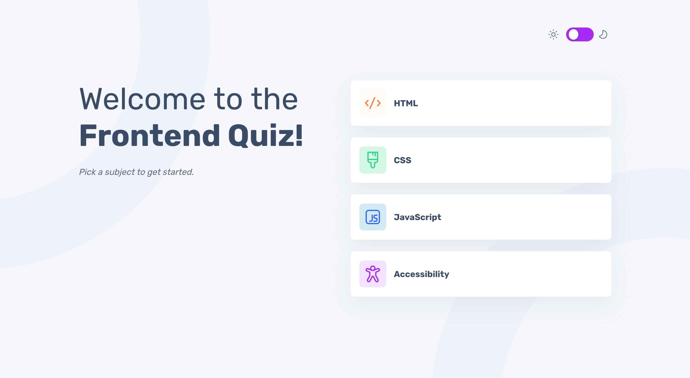

# Frontend Mentor - Frontend quiz app solution

This is a solution to the [Frontend quiz app challenge on Frontend Mentor](https://www.frontendmentor.io/challenges/frontend-quiz-app-BE7xkzXQnU). Frontend Mentor challenges help you improve your coding skills by building realistic projects.

## Table of contents

- [Overview](#overview)
  - [The challenge](#the-challenge)
  - [Screenshot](#screenshot)
  - [Links](#links)
- [My process](#my-process)
  - [Built with](#built-with)
  - [What I learned](#what-i-learned)
  - [Continued development](#continued-development)
  - [Useful resources](#useful-resources)
- [Author](#author)
- [Acknowledgments](#acknowledgments)

## Overview

### The challenge

Users should be able to:

- Select a quiz subject
- Select a single answer from each question from a choice of four
- See an error message when trying to submit an answer without making a selection
- See if they have made a correct or incorrect choice when they submit an answer
- Move on to the next question after seeing the question result
- See a completed state with the score after the final question
- Play again to choose another subject
- View the optimal layout for the interface depending on their device's screen size
- See hover and focus states for all interactive elements on the page
- Navigate the entire app only using their keyboard
- **Bonus**: Change the app's theme between light and dark

### Screenshot



### Links

- Solution URL: [https://github.com/gmagnenat/frontend-quiz-app](https://github.com/gmagnenat/frontend-quiz-app)
- Live Site URL: [https://snazzy-llama-8b8d15.netlify.app/](https://snazzy-llama-8b8d15.netlify.app/)

## My process

- I start by building all the functional blocs and separating utils functions in their own files.
- I write tests for the utils functions.
- Most of the markup here is done in the different render function.
- I start by working on the css for mobile.
- I test interactive elements such as buttons, theme switch with voice over for accessibility and adapt the code where needed.
- I continue writing css for the larger screens.
- I optimize assets such as fonts in woff2
- I optimize for better web vitals
  - assets such as fonts in woff2
  - load fonts in the index.html
  - preload some assets such as a few icons that will need to be displayed later.
- Test final deployement and addapt redirects with specific settings for hosting.

### Built with

- Semantic HTML5 markup
- CSS custom properties
- Flexbox
- CSS Grid
- Mobile-first workflow
- SPA
- Typescript
- The History API
- Vitest

### What I learned

**Normalizing the quizz titles**
I wanted to allow use to share a url for the specific quiz. For example : https://snazzy-llama-8b8d15.netlify.app/html . In the data, the different quizz have different formatting (Uppercase, Capitalize) so I needed to normalize that to handle all cases.
I used an enum with the different quizz to normalize the titles.

```js
enum QuizType {
  HTML = "HTML",
  CSS = "CSS",
  JAVASCRIPT = "JavaScript",
  ACCESSIBILITY = "Accessibility",
}
```

I then used that in the `selectQuiz` function to modify the titles.

```js
export function selectQuiz(title: string): Quiz | undefined {
  const normalizedTitle = title.toUpperCase() as keyof typeof QuizType;
  if (!Object.values(QuizType).includes(QuizType[normalizedTitle])) {
    return undefined;
  }
  const quizzes = loadData();
  return quizzes.find((quiz) => quiz.title === QuizType[normalizedTitle]);
}
```

Now the user can type the part of the url how they want and it will load the appropriate quiz.

**Netlify Redirect for SPA**
When deploying an SPA on Netlify I need to add a `_redirect` file or a `netlify.toml` file to handle URL routing. Netlify is optimised for static sites, which serves files from a specific path (ex: /about, /contact). The problem with SPA rely on client-side routing where JavaScript controls navigation and the server always serves the same index.html regardless of the route. for example:

- `/about` is handled by the client-side router, not the server.
- Without configuration, navigating directly to `/about` on Netlify can reuslt in a "404 not found" error because Netlify looks for an "about.html" file.

#### The `_redirect` file

This file allows you to define custom routing rules for your site. Typically for SPA you add this rule:

```bash
/* /index.html 200
```

- `/*` Matches all routes
- `/index.html` tells the server to server `index.html` for all the routes.
- `200` indicates a successful response instead of a 404

#### The `netlify.toml` file

This is another way to define configuration for your Netlify deployment, including redirects. For SPA you might use:

```yaml
[[redirects]]
  from = "/*"
  to = "/index.html"
  status = 200
```

### Continued development

On some questions the layout switches a few pixels after validation when the check or error icons are added.

### Useful resources

https://docs.netlify.com/routing/redirects/

## Author

- Website - [Gwenaël Magnenat](https://gmagnenat.com)
- Frontend Mentor - [@gmagnenat](https://www.frontendmentor.io/profile/gmagnenat)
- LinkedIn - [@gmagnenat](https://linkedin.com/in/gmagnenat)
